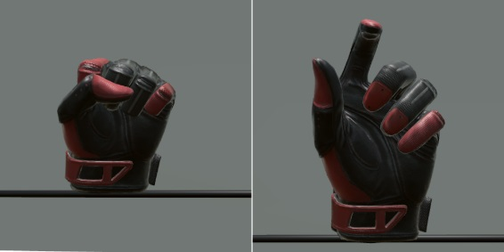
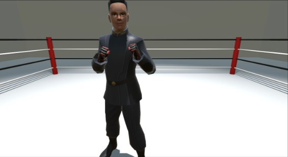
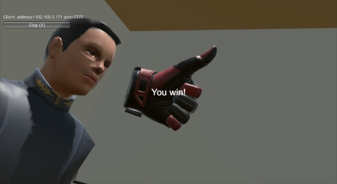

# Project Saggita (Valve Index VR Unity Network Game demo)

As the title says, this is an Valve Index VR Network Game demo. It was done for my thesis at Cracow University of Technology. It's an implementation of transfering Valve Index controllers' whole movement through the internet, predicting players' poses and making a simple boxing game.

This is available as-is. There are some information (in polish) in the thesis and presentation files `Dyplom-Dawid-Lubera.docx` and `Pierwszoosobowa sieciowa gra akcji dla gogli wirtualnej rzeczywistości.pptx`, but there will be no more work in this repository.

## Screenshots

